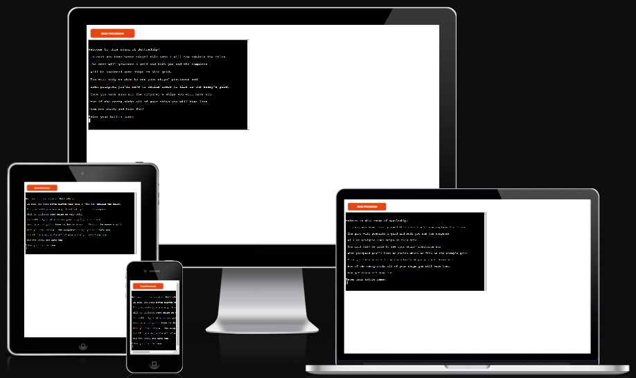
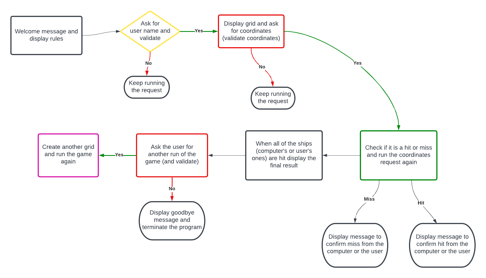
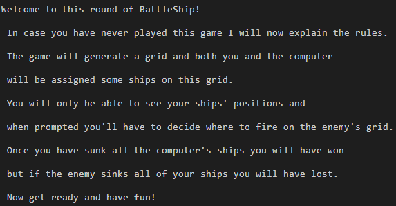
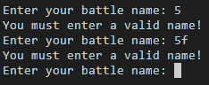
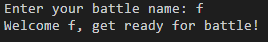
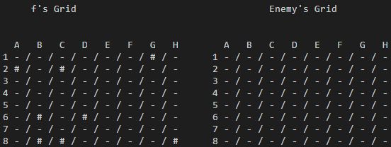
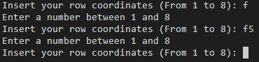
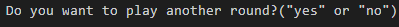
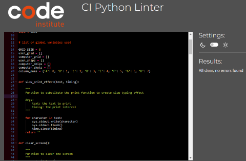

# Fabrizio Milestone Project 3

#### [Link to Deployed Project](https://fabrizio-project-three.herokuapp.com/)

## Introduction

This the third project for the Code Institute Full Stack curriculum. Due to the fact that the only programming language used is Python, the project will mostly lack a modern user interface and will have little to no styling. These are the reasons why I have decided not to describe the project using the design principles used for all the previous websites I created. As a general overview this project is my first attempt at a terminal based game. I have decided to code a battleship game as suggested in the project ideas from Code Institute. This README file will contain description of the features and other details about my approach and specific content of the software.

## Project Goals

The main goals for this project is to create an entertaing game using the python programming language. Being this my first attempt at a project like this I have decided to implement simple features that would allow the user to experience a fluid gaming session. In addition to that the general aim was to provide game that would utilize user input to carry on the program until either the computer or the user reached a satisfactory condition (win or lose system).

### Target 

Given the almost legendary history of this game, the target audience is broadly represented by almost all ages. The game is relatively easily understood and the rules rarely create a barrier to the access of it. As a general rule of thumb I feel confident to say that this specific type of game can be played from anyone aged from 8 years old to 99+. For my version of the game the only impairment could be the language used.

## User Story

In order to better understand the flow of the game I will list the User Story as in the steps that the user will take to play the game.
As a User I want to:

* Read the instructions when the game starts 
* Input my battle name when presented with the user input on the terminal
* Allow the game to generate a grid for me and for the cpu
* Take mental note of the positions of my ships on the grid
* Input a number to target a specific row to hit
* Input a capital character to hit a specific column on the row I had previously chosen
* Evaluate if I hit or missed the enemy's ships
* Evaluate if the enemy hit or missed my ships
* Repeat the row and column selection until game completion

## Software Logic

The image above is a visual representation of the logic of the software. In order to avoid any faulty run of the game, a series of validations have been implemented. During the execution of the various functions the game will not proceed unless the required imput from the user is validated. This is to ensure that the data provided by the user is exactly what the respective function was expecting.

## Interactions and Features

Obviously the only interactions possible in a text based game that runs in a terminal are text input and some mouse clicking. When it comes to features though, I have decided to include some different solutions to make the game easy to understand for the user. Some of these features include validation of the user's input and a correct distribution of the text on the terminal.

### Features Used

The following is a series of screen shots taken from the terminal in order to display the features used in the game:

This is the first feature shown when the user starts the game. This welcome message is also used to provide the instructions for the game. As many other times during the flow of the game, I have used a slow typing effect in order to convey a sense of dynamism to an otherwise static terminal.

In this second feature it's possible to see how the validation works for the user battle name input works. I have implemented the logic to only allow alphabetic characters so an empty input or any other combination will not work and the input will be prompted again. 

Once the user has provided a battle name the above message is displayed. I have included this feature to let the user know that the game, once input the chosen name, will be about to start.

Finally the grids are printed to the terminal. I decided to placed them side by side because I had enough space in the terminal to do so and also because printing them one after the other in a vertical fashion would have been less practical and wouldn't have let the user gain situational awereness of the flow of the game.

This feature is about the input for the coordinates that the user wants to target. Only the row validation is shown in the image but the logic and presentation is the same for the column input as well. The only difference is that for the rows I have used a "numeric only" data type and for the columns a "capital alphabetic only". In both cases the game will not proceed if the correct input isn't provided by the user.

This message is what appears once either the player or the cpu wins the game. The result is to run another game for a positive input and to exit the game for a negative one. The negative outcome (exiting the game) has been timed with a clear screen function at the end to emphasize the impression of the end of the software.

### Future Features

The possible future features that could be implemented in the game are:
* The possibility to generate a custom sized grid through user input
* Creating a graphic interface in order to display the game on a UI instead that on the terminal
* Creating a function (or modifying an existing one) to limit the number of shots allowed
* Increasing the difficulty of the game by setting a time limit for every shot attempt
* Allowing the game to create ships of different sizes

## Testing and Technologies 

### Tech Used

The technologies and softwares used for this project are the following:
* CodeAnywhere as the IDE and code editor
* Heroku as the deployment platform
* Python Tutor as a tool to test partial code and review the flow of the program 
* GitHub as the repository holder
* [Tables Generator](https://tablesgenerator.com/) for the markdown table 

### Bugs

During the creation of this program I have encountered many bugs. I was able to fix them (some faster than others) with some Google searches or mainly just by going through the code. The majority of the bugs were caused by a mistake in indentation and targeting the wrong element. A valid "lesson learned" from this project is surely the fact that is important to go through your code line by line to make sure everything is working correctly.

### Validation

### Python Linter

The following is the result of the linter provided by Code Insitute. 

### Manual Testing

In order to manually test the code a series of user input validation checks have been put into place to ensure a smooth run of the program.
The validations are also necessary in order to allow the user to insert the correct data type or input. The following is a table with the tests applied:

| Test         | Valid input            | Invalid input                                                                         | No input                          |   |
|--------------------|--------------------------|-------------------------------------------------------------------------------------|-----------------------------------|---|
| User battle name input  | The game runs correctly  | The game gives suggestions on the correction to make.  Runs the input request again | The game waits for the user input |
| Row coordinates    | The game runs correctly  | The game alerts the user of the wrong input. Runs the input request again  | The game waits for the user input | 
| Column coordinates | The game runs correctly |  The game alerts the user of the wrong input. Runs the input request again  | The game waits for the user input | 
| Next round | In case of 'yes' the game runs another game. In case of 'no' the game ends | The game asks for a correct input and runs the request again. | The game waits for user input |

## Deployment and Updates

### Deployment Steps

The deployment of this project was made on Heroku instead of GitHub Pages. The steps I followed are the following:
 * Open the Heroku app and access my account
 * Created a new app for the project
 * Insert the Python and Node.js settings in the correct order
 * Insert the Key: PORT and Value: 8000 in the Config Var section
 * Linked my GitHub repo in the settings
 * Deployed manually in the "Deploy" section

## Development

### For the next Programmer

The code has been structured to allow the next developers to easily access the parts of the program that they would like to change. This has been done by creating a series of functions with granular specificity. This permits to fine tune the next changes to only the parts that we want to modify. 

### Software Maintenance and Updates

A correct indentation has been used in the code to allow future developers to maintain and update the code. In addition to that I have also used a series of functions to run specific parts of the game. These functions are then sequentially called in a general function that runs the main logic for the game. This structure makes it easier to modify the different functions to provide other functionality. It is also possible to modify the main logic of the game in the "run_game" function to twitch the flow of the game. 

## Credits

For this game I have used the following websites for development and testing:
* [Tables Generator](https://tablesgenerator.com/) for the markdown table.
* [Python Tutor](https://pythontutor.com/) for the debugging
* [Heroku](https://www.heroku.com/platform) for the deployment
* [GitHub](https://www.heroku.com/platform) as the repository platform
* [Codeanywhere](https://www.heroku.com/platform) as the cloud-based code editor

